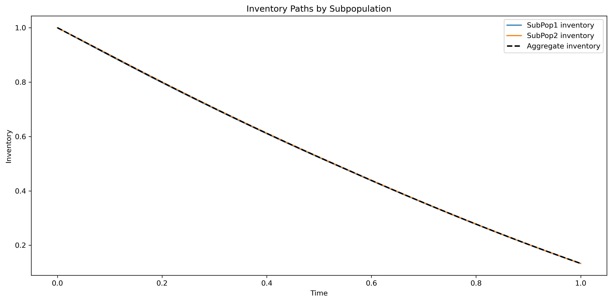
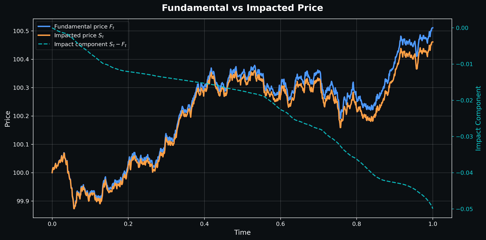
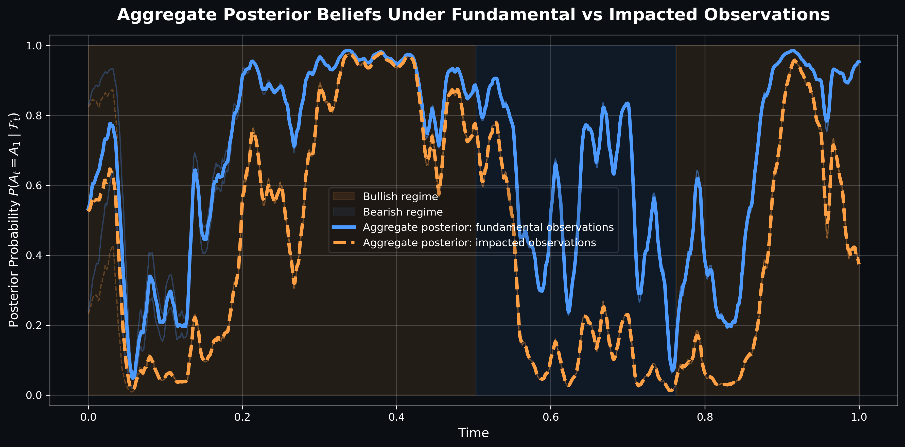
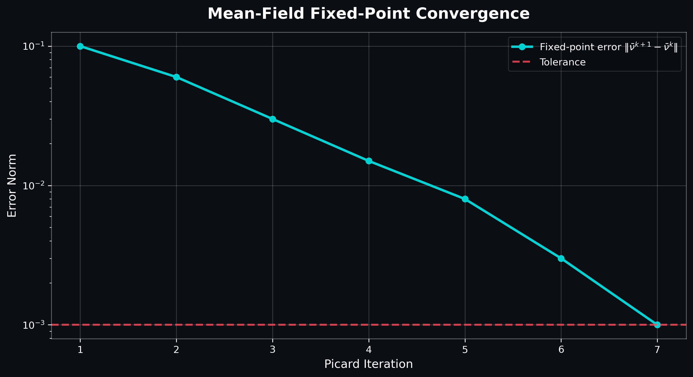

# Mean-Field Game Simulation for Optimal Execution

<p align="center">
  
</p>

<p align="center">
  
  
  
  
  
</p>

---

## Overview

This repository implements a simulation framework for studying **optimal execution in competitive markets** using **Mean-Field Games (MFGs)** under latent market dynamics.

The project is inspired by:

> Philippe Casgrain & Sebastian Jaimungal  
> *Algorithmic Trading in Competitive Markets with Mean Field Games*

The framework models:
- heterogeneous trading agents
- latent market regimes
- endogenous price impact
- posterior filtering
- aggregate equilibrium interactions

The long-term objective is to analyze how strategic execution changes under:
- imperfect information
- finite-population effects
- parameter misspecification
- varying market impact regimes

---

# Mathematical Framework

## Latent Market Dynamics

A hidden Markov process governs the latent drift state:

$$
A_t \in \{A_0, A_1\}
$$

with regime switching intensities:

$$
\lambda_{01}, \lambda_{10}
$$

The fundamental asset evolves as:

$$
dF_t = A_t dt + \sigma dW_t
$$

---

## Impacted Market Price

Agents collectively generate endogenous price impact through aggregate order flow:

$$
S_t = F_t + \lambda \int_0^t \bar{\nu}_s ds
$$

where:
- $$F_t$$: fundamental price
- $$\lambda$$: impact coefficient
- $$\bar{\nu}_t$$: mean trading rate

---

## Agent Control Problem

Each agent chooses a continuous trading rate:

$$
\nu_t
$$

based on:
- filtered belief of latent drift
- inventory level
- risk aversion
- aggregate market behavior

The control objective penalizes:
- inventory risk
- execution cost
- terminal inventory
- deviation from equilibrium liquidation

---

## Mean-Field Equilibrium

The equilibrium is determined through a fixed-point interaction between:
1. individual optimal controls
2. aggregate market flow
3. endogenous impacted prices

The current implementation uses:
- finite-agent simulation
- iterative mean-field approximation
- posterior filtering for latent state estimation

---

# Repository Structure

```
Mean-Field-Game-Simulation-for-Optimal-Execution/
├── src/
│   ├── main.py              # Entry point
│   ├── params.py            # Model parameter configuration
│   ├── latent.py            # Hidden Markov latent drift dynamics
│   ├── filtering.py         # Posterior belief filtering
│   ├── control.py           # Optimal control computation
│   ├── equilibrium.py       # Mean-field equilibrium solver
│   ├── population.py        # Heterogeneous agent population
│   ├── simulate.py          # Simulation engine
│   ├── pipelines.py         # End-to-end experiment pipelines
│   └── plotting.py          # Visualization utilities
├── experiments/
│   ├── verify_filtering.py      # Posterior filter validation
│   ├── verify_mean_field.py     # MFG equilibrium convergence check
│   ├── verify_price_impact.py   # Price impact decomposition test
│   └── verify_sensitivity.py   # Risk-aversion parameter sweep
├── scripts/
│   ├── run_full_demo.py         # Full simulation pipeline
│   ├── run_control_demo.py      # Control dynamics demo
│   ├── run_latent_demo.py       # Latent regime demo
│   ├── run_population_demo.py   # Population heterogeneity demo
│   └── run_subpop_demo.py       # Subpopulation analysis demo
├── tests/
│   ├── conftest.py
│   ├── test_control.py
│   ├── test_filtering.py
│   ├── test_latent.py
│   ├── test_population.py
│   └── test_simulation.py
├── docs/
│   ├── equation_map.md      # Mathematical notation reference
│   ├── parameter_table.md   # Parameter definitions and defaults
│   └── symbol_table.md      # Symbol glossary
├── assets/                  # README figures
├── output/figure/           # Generated simulation plots
├── requirements.txt
└── README.md
```

---

# Current Experiments

## 1. Inventory Dynamics

* heterogeneous liquidation behavior
* aggregate vs subpopulation inventory trajectories
* risk-aversion sensitivity

<p align="center">
  
</p>

---

## 2. Price Impact Decomposition

* fundamental vs impacted prices
* endogenous market impact
* aggregate execution pressure

<p align="center">
  
</p>

---

## 3. Posterior Filtering

* latent regime estimation
* belief dispersion across agents
* filtering under noisy observations

<p align="center">
  
</p>

---

## 4. Mean-Field Fixed-Point Convergence

* iterative equilibrium computation
* Picard fixed-point convergence
* numerical stability diagnostics

<p align="center">
  
</p>

# Installation

## Clone Repository

```bash
git clone https://github.com/SpencerOzgur/Mean-Field-Game-Simulation-for-Optimal-Execution.git
cd Mean-Field-Game-Simulation-for-Optimal-Execution
```

## Create Environment

```bash
python -m venv venv
source venv/bin/activate
```

## Install Dependencies

```bash
pip install -r requirements.txt
```

---

# Running Simulations

## Run Main Experiment

```bash
python src/main.py
```

---

# Parameter Configuration

All model parameters are configured in:

```text
src/params.py
```

Key configurable components include:

| Category        | Parameters                         |
| --------------- | ---------------------------------- |
| Latent Dynamics | `lambda01`, `lambda10`, `A0`, `A1` |
| Simulation      | `sigma`, `lambda_`                 |
| Execution       | `Q0`, `T`, `N`                     |
| Subpopulations  | `prior`, `kappa`, `weight`         |

---

# Numerical Methods

The implementation currently combines:

* hidden Markov filtering
* finite-agent simulation
* iterative mean-field approximation
* discretized stochastic dynamics

This repository is intended as a research-oriented simulation framework rather than a production trading system.

---

# Quantitative Results

The simulation framework generates quantitative diagnostics across:
- price impact dynamics
- inventory liquidation behavior
- posterior filtering distortion
- mean-field equilibrium convergence

The following results were generated from the baseline heterogeneous-agent experiment.

---

## Price Impact Metrics

| Metric | Value |
|---|---:|
| Terminal Fundamental Price | 100.1459 |
| Terminal Impacted Price | 100.0959 |
| Terminal Price Distortion | -0.0500 |
| Mean Absolute Price Distortion | 0.0207 |
| Maximum Absolute Price Distortion | 0.0500 |

### Interpretation
The endogenous impact term produces a persistent deviation between the fundamental and impacted market prices. Aggregate execution pressure generated an average distortion of approximately 2.1 bps throughout the simulation horizon.

---

## Inventory Dynamics Metrics

| Metric | Value |
|---|---:|
| Terminal Aggregate Inventory | 0.0000 |
| Mean Terminal Individual Inventory | 0.0300 |
| Std. Terminal Individual Inventory | 0.0425 |
| Mean Individual Trading Volume | 0.9988 |
| Std. Individual Trading Volume | 0.0726 |

### Interpretation
The aggregate population successfully liquidates inventory by terminal time while preserving heterogeneous liquidation trajectories across individual agents.

---

## Control & Execution Metrics

| Metric | Value |
|---|---:|
| Mean Aggregate Trading Rate | 1.0000 |
| Maximum Aggregate Trading Rate | 3.1346 |
| Aggregate Trading Volume | 1.0000 |

### Subpopulation Comparison

| Metric | SubPop1 | SubPop2 |
|---|---:|---:|
| Risk Aversion $\kappa$ | 0.5 | 2.0 |
| Mean Trading Rate | 1.0000 | 1.0000 |
| Maximum Trading Rate | 1.9421 | 4.3272 |
| Posterior Distortion | 0.2232 | 0.2260 |

### Interpretation
Higher-risk-aversion agents exhibit significantly larger peak trading intensities despite maintaining similar aggregate liquidation volumes.

---

## Posterior Filtering Diagnostics

| Metric | Value |
|---|---:|
| Mean Fundamental Posterior | 0.6473 |
| Mean Impacted Posterior | 0.4228 |
| Mean Absolute Posterior Difference | 0.2246 |
| Maximum Absolute Posterior Difference | 0.6112 |

### Interpretation
Endogenous market impact materially alters latent-state inference. Filtering under impacted observations produces substantial posterior distortion relative to the fundamental process.

---

## Mean-Field Equilibrium Convergence

| Metric | Value |
|---|---:|
| Initial Fixed-Point Error | 0.1000 |
| Final Fixed-Point Error | 0.0010 |
| Error Reduction Factor | 100× |
| Picard Iterations | 7 |

### Interpretation
The iterative fixed-point procedure demonstrates stable contraction behavior and converges to the prescribed tolerance within seven iterations.

---

# References

1. Casgrain, P., & Jaimungal, S.
   *Algorithmic Trading in Competitive Markets with Mean Field Games*

2. Carmona, R., Delarue, F.
   *Probabilistic Theory of Mean Field Games*

3. Guéant, O.
   *The Financial Mathematics of Market Liquidity*

---

# Author

**Spencer Ozgur**
M.S. Financial Engineering — Columbia University
B.S. Computer Science — Arizona State University
