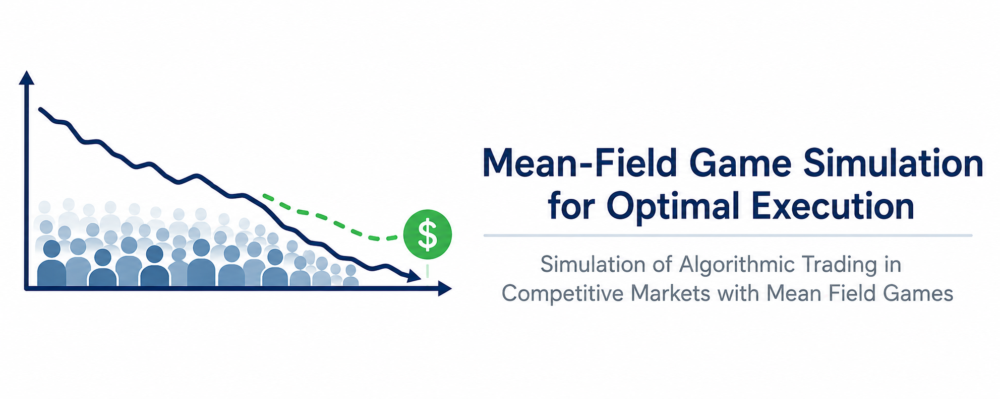

# Mean-Field Game Simulation for Optimal Execution

<p align="center">
  
</p>

<p align="center">
  
  
  
  
  
</p>

---

## Overview

This repository implements a simulation framework for studying **optimal execution in competitive markets** using **Mean-Field Games (MFGs)** under latent market dynamics.

The project is inspired by:

> Philippe Casgrain & Sebastian Jaimungal  
> *Algorithmic Trading in Competitive Markets with Mean Field Games*

The framework models:
- heterogeneous trading agents
- latent market regimes
- endogenous price impact
- posterior filtering
- aggregate equilibrium interactions

The long-term objective is to analyze how strategic execution changes under:
- imperfect information
- finite-population effects
- parameter misspecification
- varying market impact regimes

---

# Mathematical Framework

## Latent Market Dynamics

A hidden Markov process governs the latent drift state:

$$
A_t \in \{A_0, A_1\}
$$

with regime switching intensities:

$$
\lambda_{01}, \lambda_{10}
$$

The fundamental asset evolves as:

$$
dF_t = A_t dt + \sigma dW_t
$$

---

## Impacted Market Price

Agents collectively generate endogenous price impact through aggregate order flow:

$$
S_t = F_t + \lambda \int_0^t \bar{\nu}_s ds
$$

where:
- \(F_t\): fundamental price
- \(\lambda\): impact coefficient
- \(\bar{\nu}_t\): mean trading rate

---

## Agent Control Problem

Each agent chooses a continuous trading rate:

$$
\nu_t
$$

based on:
- filtered belief of latent drift
- inventory level
- risk aversion
- aggregate market behavior

The control objective penalizes:
- inventory risk
- execution cost
- terminal inventory
- deviation from equilibrium liquidation

---

## Mean-Field Equilibrium

The equilibrium is determined through a fixed-point interaction between:
1. individual optimal controls
2. aggregate market flow
3. endogenous impacted prices

The current implementation uses:
- finite-agent simulation
- iterative mean-field approximation
- posterior filtering for latent state estimation

---

# Repository Structure

```text
src/
├── control.py          # execution control laws
├── equilibrium.py      # mean-field fixed-point solver
├── filtering.py        # posterior filtering
├── latent.py           # hidden Markov dynamics
├── simulate.py         # price simulation engine
├── population.py       # heterogeneous agent populations
├── plotting.py         # visualization utilities
└── params.py           # global model parameters

figures/
├── inventory_paths.png
├── impacted_price.png
├── posterior_filter.png
└── equilibrium_flow.png
````

---

# Current Experiments

## 1. Inventory Dynamics

* heterogeneous liquidation behavior
* aggregate vs subpopulation inventory trajectories
* risk-aversion sensitivity

<p align="center">
  
</p>

---

## 2. Price Impact Decomposition

* fundamental vs impacted prices
* endogenous market impact
* aggregate execution pressure

<p align="center">
  
</p>

---

## 3. Posterior Filtering

* latent regime estimation
* belief dispersion across agents
* filtering under noisy observations

<p align="center">
  
</p>

---

# Research Directions

Planned extensions include:

* nonlinear impact functions
* deep learning approximations for MFG equilibria
* finite-player convergence analysis
* stochastic control comparisons
* calibration to empirical market microstructure data
* reinforcement learning execution policies
* robustness under latent-state misspecification

---

# Installation

## Clone Repository

```bash
git clone https://github.com/SpencerOzgur/Mean-Field-Game-Simulation-for-Optimal-Execution.git
cd Mean-Field-Game-Simulation-for-Optimal-Execution
```

## Create Environment

```bash
python -m venv venv
source venv/bin/activate
```

## Install Dependencies

```bash
pip install -r requirements.txt
```

---

# Running Simulations

## Run Main Experiment

```bash
python main.py
```

---

# Parameter Configuration

All model parameters are configured in:

```text
src/params.py
```

Key configurable components include:

| Category        | Parameters                         |
| --------------- | ---------------------------------- |
| Latent Dynamics | `lambda01`, `lambda10`, `A0`, `A1` |
| Simulation      | `sigma`, `lambda_`                 |
| Execution       | `Q0`, `T`, `N`                     |
| Subpopulations  | `prior`, `kappa`, `weight`         |

---

# Numerical Methods

The implementation currently combines:

* hidden Markov filtering
* finite-agent simulation
* iterative mean-field approximation
* discretized stochastic dynamics

This repository is intended as a research-oriented simulation framework rather than a production trading system.

---

# References

1. Casgrain, P., & Jaimungal, S.
   *Algorithmic Trading in Competitive Markets with Mean Field Games*

2. Carmona, R., Delarue, F.
   *Probabilistic Theory of Mean Field Games*

3. Guéant, O.
   *The Financial Mathematics of Market Liquidity*

---

# Author

**Spencer Ozgur**
M.S. Financial Engineering — Columbia University
B.S. Computer Science & Mathematics — Arizona State University

Interested in:

* quantitative research
* stochastic control
* market microstructure
* algorithmic trading
* machine learning for finance

```
```
